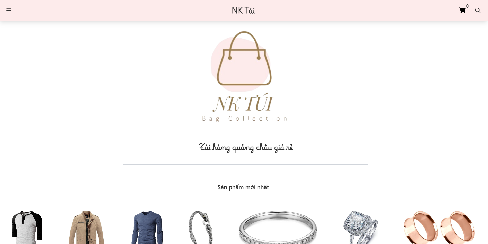
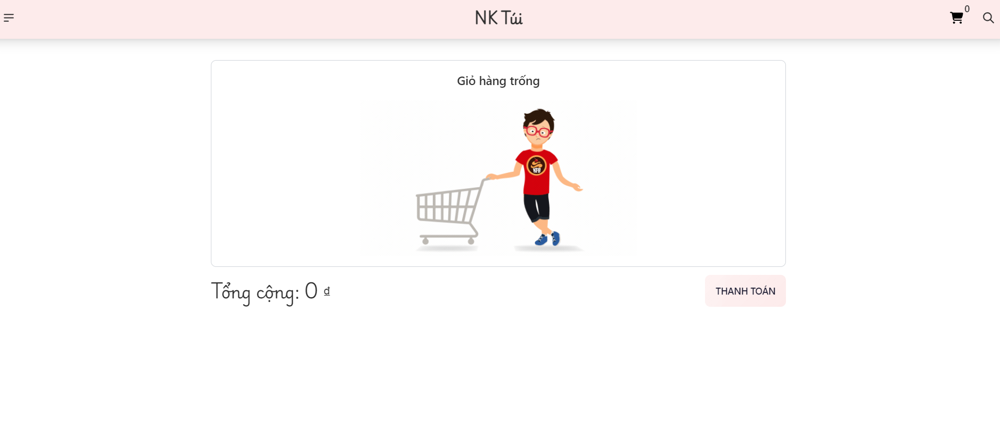
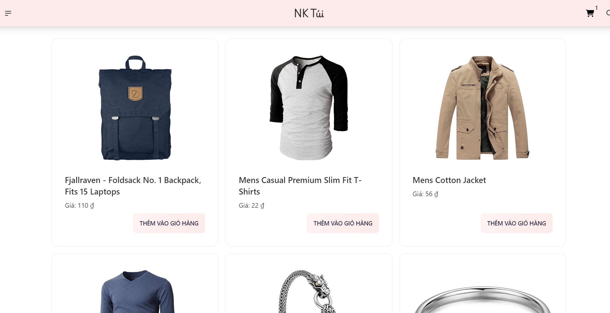
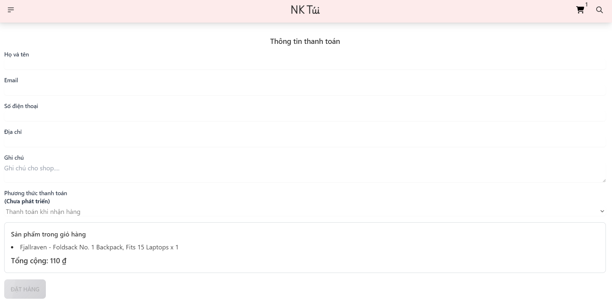

# shop-nktui

Simple front-end shopping cart with Vue, Vite, DaisyUI, Pinia






## Project setup
```
npm install
```

### Compiles and hot-reloads for development
```
npm run dev
```

### Compiles and minifies for production
```
npm run build
```